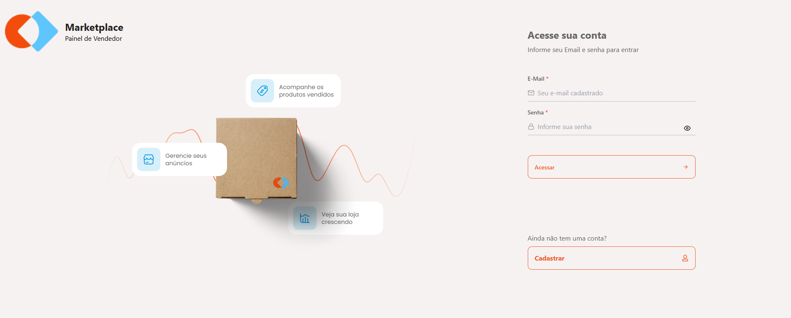
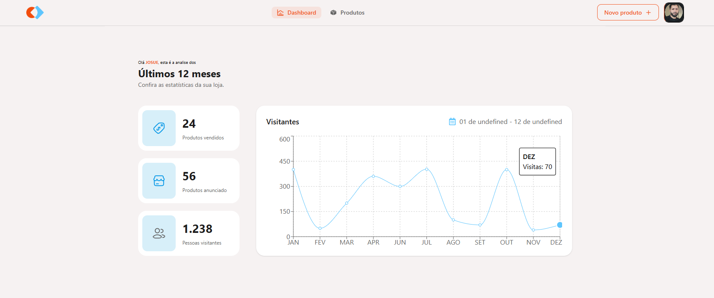
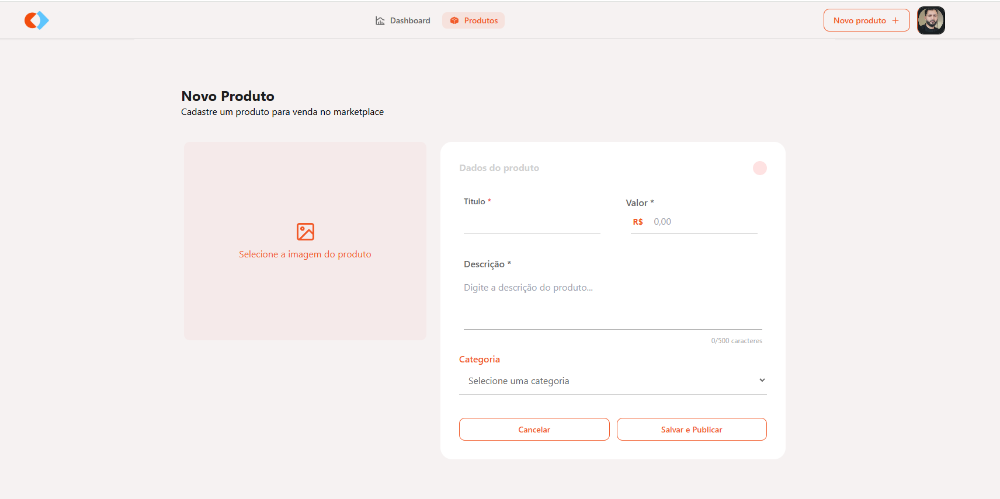

# 🛒 Marketplace Frontend

Uma aplicação React moderna para um marketplace online, oferecendo uma experiência de usuário intuitiva para compradores e vendedores.

## 🌟 Visão Geral

A Plataforma Marketplace é desenvolvida com React 18, TypeScript e Tailwind CSS. A aplicação oferece funcionalidades completas de autenticação, gerenciamento de produtos, perfil de usuário e muito mais.

## 🚀 **Links Importantes**

- **🌐 API em Produção Backend:** [https://zeine-marketplace-api.vercel.app](https://zeine-marketplace-api.vercel.app)
- **📚 Documentação da API Backend Swagger:** [https://zeine-marketplace-api.vercel.app/api/docs](https://zeine-marketplace-api.vercel.app/api/docs)
- **🔗 Repositório Backend:** [https://github.com/JosueCosta2023/zeine-marketplace-api](https://github.com/JosueCosta2023/zeine-marketplace-api)
- **🔗 Deploy Frontend:** [https://zeine-marketplace-frontend-otmw.vercel.app/login](https://zeine-marketplace-frontend-otmw.vercel.app/login)
- **🔗 Prototipo Figma:** [https://www.figma.com/design/DB09jeQKr3nebacAmJQZzw/Gest%C3%A3o-de-Marketplace-teste-tec-sinop?node-id=3-376&p=f&t=d5cSrpYKBoddHf4h-0](https://www.figma.com/design/DB09jeQKr3nebacAmJQZzw/Gest%C3%A3o-de-Marketplace-teste-tec-sinop?node-id=3-376&p=f&t=d5cSrpYKBoddHf4h-0)

## 🚀 Funcionalidades Principais

### 🔐 Autenticação e Autorização

- **Login/Registro**: Sistema completo de autenticação com JWT
- **Proteção de Rotas**: Rotas protegidas baseadas no status de autenticação
- **Gerenciamento de Sessão**: Persistência de dados do usuário com localStorage
- **Perfil de Usuário**: Edição completa de perfil com upload de imagem

### 📦 Gerenciamento de Produtos

- **Listagem de Produtos**: Visualização organizada e responsiva
- **Filtros Avançados**: Filtragem por categoria, status e usuário
- **CRUD Completo**: Criação, edição e exclusão de produtos
- **Produtos por Usuário**: Visualização personalizada dos próprios produtos

### 🎨 Interface do Usuário

- **Componentes Reutilizáveis**: Arquitetura modular e escalável
- **Feedback Visual**: Indicadores de carregamento e mensagens de status
- **Easter Egg**: Funcionalidade especial oculta no header

## 📐 Previa de Design

Pagina de login:


Pagina Home:


Pagina de cadastro de Produtos:


## 🛠️ Tecnologias Utilizadas

### Core Technologies

- **React 18**: Biblioteca principal para construção da UI
- **TypeScript**: Tipagem estática para maior segurança do código
- **Vite**: Build tool moderna e rápida
- **React Router DOM**: Navegação e roteamento

### Styling & UI

- **Tailwind CSS**: Framework CSS utility-first
- **React Icons**: Biblioteca completa de ícones
- **CSS Modules**: Estilização component-scoped

### State Management & HTTP

- **Context API**: Gerenciamento de estado global
- **Axios**: Cliente HTTP para comunicação com API
- **localStorage**: Persistência de dados do usuário

## 📁 Estrutura do Projeto

```
src/
├── features/          # Funcionalidades organizadas por domínio
│   ├── auth/          # Autenticação e autorização
│   │   ├── components/
│   │   └── pages/
│   └── commun/        # Componentes e páginas compartilhados
│       ├── ArchiveImport/
│       └── pages/
├── layout/            # Componentes de layout
├── routes/            # Configuração de rotas
├── styles/            # Estilos globais
└── assets/            # Recursos estáticos
```

## 🎯 Componentes Principais

### 🔑 AuthContext

**Localização**: `src/features/auth/context/AuthContext.tsx`

- Gerenciamento global do estado de autenticação
- Sincronização com localStorage
- Atualização de dados do usuário em tempo real

### 📋 ProductsListPage

**Localização**: `src/features/auth/pages/ProductsListPage.tsx`

- Listagem completa de produtos
- Sistema de filtros avançado
- Normalização de dados da API
- Filtragem por usuário logado

### 👤 PerfilUserPage

**Localização**: `src/features/auth/pages/PerfilUserPage.tsx`

- Edição completa do perfil
- Upload e preview de imagem
- Atualização em tempo real

### 🧭 Header

**Localização**: `src/layout/Header.tsx`

- Navegação principal
- Menu responsivo
- Easter egg secreto (hover 7 segundos no botão)

## 🔧 Configuração e Instalação

### Pré-requisitos

- Node.js 18+
- npm ou yarn
- Git

### Instalação

1. **Clone o repositório**

```bash
git clone https://github.com/JosueCosta2023/zeine-marketplace-frontend.git
```

2. **Instale as dependências**

```bash
npm install
# ou
yarn install
```

3. **Configure as variáveis de ambiente**

```bash
# Crie um arquivo .env na raiz do projeto
VITE_API_URL=seu_url_local
```

4. **Execute o projeto**

```bash
npm run dev
# ou
yarn dev
```

5. **Acesse a aplicação**

```
http://localhost:5173
```

## 🌐 Scripts Disponíveis

```bash
# Desenvolvimento
npm run dev           # Inicia o servidor de desenvolvimento

# Build
npm run build         # Gera build de produção

```

## 🔐 Autenticação e Segurança

### Sistema de Autenticação

- **JWT Token**: Autenticação baseada em tokens
- **Interceptors**: Configuração automática de headers
- **Refresh Token**: Renovação automática de sessão
- **Logout Seguro**: Limpeza completa do estado

### Proteção de Dados

- **Validação de Formulários**: Validação robusta no frontend
- **Sanitização**: Tratamento seguro de inputs do usuário
- **HTTPS**: Comunicação segura em produção


## 🚀 Deploy e Produção

### Vercel (Recomendado)

```bash
npm install -g vercel
vercel --prod
```

### Build Manual

```bash
npm run build
# Arquivos gerados em ./dist
```

## 👨‍💻 **Autor**

### Josué Ocanha Costa
#### FrontEnd Developer
#### Redes Sociais

- Linkedin - [JosueOcanhaCosta](https://www.linkedin.com/in/josue-ocanha-costa/)
- Github - [JosueCosta2023](https://github.com/JosueCosta2023)
- Twitter - [@JosueOcanhaCosta](https://twitter.com/josue_ocanha)
- Facebook - [JosueCosta](https://www.facebook.com/JosueOcanhaCosta2023)
- Whatsapp - [Josue2023](https://wa.me/5565996408371?text=Ol%C3%A1%2C+encontrei+seu+whatsapp+no+Github.+Gostaria+de+falar+sobre+seus+projetos.)

# "Vida longa e próspera. 🖖🖖🖖"
Feito com o ❤️ por Josué Ocanha Costa

---

⭐ **Se este projeto te ajudou, deixe uma estrela!** ⭐
